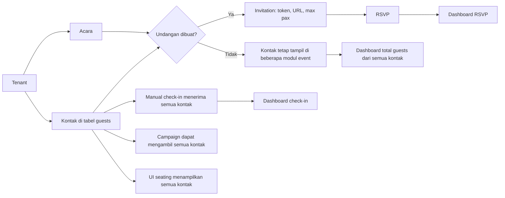
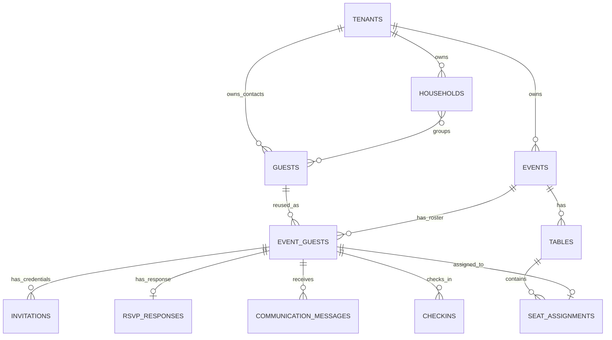
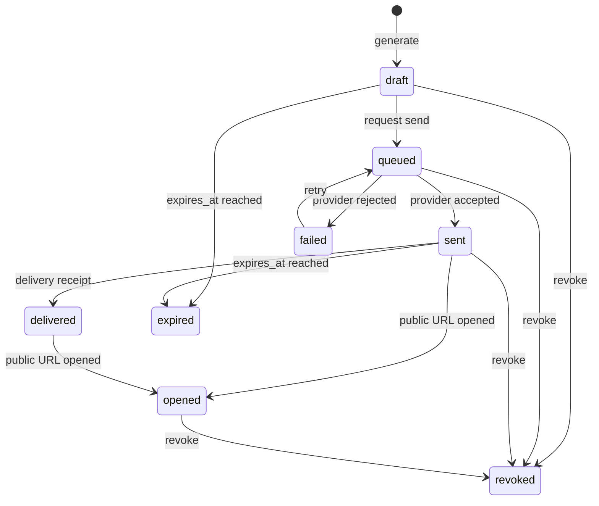
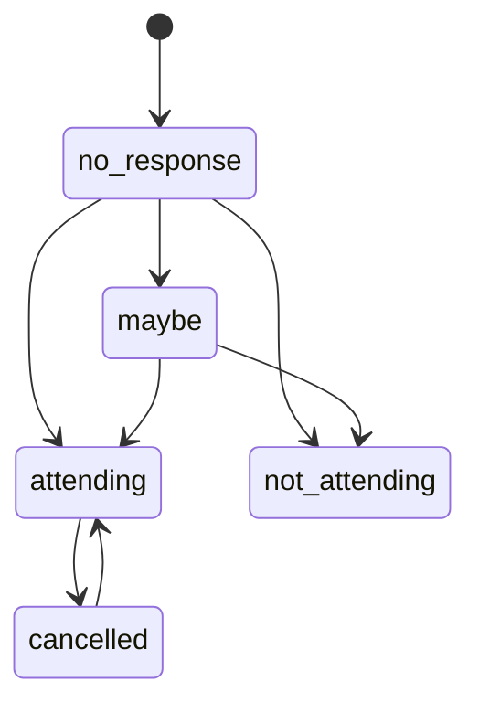
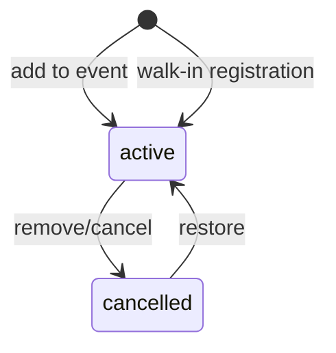
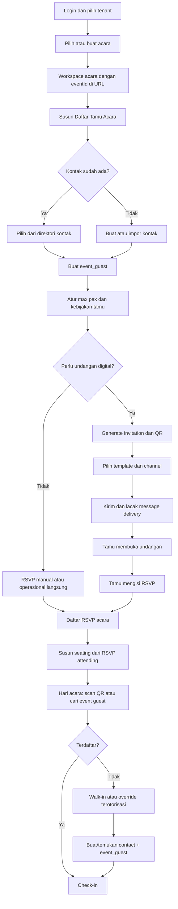

# Audit Alur Bisnis dan Skema Perbaikan GuestFlow

Tanggal audit: 14 Juli 2026  
Ruang lingkup: backend `guestbook`, frontend `guestbook-ui`, migrasi basis data, endpoint, dan pengujian yang tersedia.

## 1. Ringkasan Eksekutif

Masalah utama GuestFlow adalah tidak adanya entitas yang secara eksplisit menyatakan bahwa suatu kontak menjadi tamu pada acara tertentu. Saat ini:

- `guests` adalah direktori kontak milik tenant.
- `invitations` sekaligus dipakai sebagai penghubung kontak ke acara.
- beberapa modul memakai seluruh kontak tenant, sedangkan modul lain memakai undangan, RSVP, check-in, atau tamu yang sudah check-in.

Akibatnya, istilah "tamu acara" memiliki arti berbeda pada setiap halaman. Hal ini menjelaskan kebingungan pada menu Tamu dan Undangan, sekaligus menyebabkan denominator statistik, target kampanye, daftar check-in, dan kandidat seating tidak konsisten.

Keputusan desain yang direkomendasikan:

1. Pertahankan `guests` sebagai direktori kontak tenant dan ubah label UI menjadi **Kontak**.
2. Tambahkan `event_guests` sebagai sumber kebenaran daftar tamu setiap acara.
3. Jadikan undangan sebagai kredensial digital untuk `event_guest`, bukan sebagai membership acara.
4. Gunakan URL `/events/:eventId/...` sebagai konteks acara kanonis; local storage hanya cache.
5. Paksa RSVP, komunikasi, seating, check-in, dan metrik dashboard membaca populasi `event_guests` yang sama.

Klasifikasi kompleksitas perbaikan: **menengah-besar**, karena perubahan menyentuh model data, kontrak API, navigasi, dan hampir semua modul operasional.

## 2. Jawaban atas Ambiguitas Utama

### 2.1 Apakah menu Tamu seharusnya berdasarkan acara?

Ya, jika menu tersebut berada di workspace acara dan menampilkan RSVP, undangan, kursi, serta check-in. Namun data `guests` saat ini sebenarnya adalah master kontak tenant dan tidak memiliki `event_id`.

Karena kontak dapat dipakai kembali pada banyak acara, solusi yang tepat bukan menambahkan `event_id` langsung ke `guests`, melainkan memisahkan:

- **Kontak**: orang yang dikenal tenant dan dapat dipakai ulang lintas acara.
- **Tamu Acara**: kontak yang dipilih untuk sebuah acara melalui `event_guests`.

### 2.2 Undangan saat ini dibuat berdasarkan apa?

Pada backend, undangan dibuat berdasarkan kombinasi:

- tenant aktif;
- acara aktif pada URL endpoint;
- satu atau beberapa `guest_id` dari direktori kontak tenant.

Database membatasi satu undangan aktif per pasangan `(event_id, guest_id)`. Undangan langsung menghasilkan token, URL publik, batas pax, dan status `draft`.

Pada frontend saat ini, konteks acara berasal dari `currentEvent` tersembunyi di Zustand/local storage. Dialog massal justru menampilkan undangan `pending` yang sudah ada dan menyimpan `invitation.id` ke daftar yang dikirim sebagai `guest_ids`. Alur ini salah arah: kandidat seharusnya kontak/tamu acara yang **belum memiliki undangan**, dan payload harus berisi `guest_id` atau `event_guest_id`.

### 2.3 Apakah membuat undangan sama dengan mengirim undangan?

Tidak. Keduanya harus menjadi proses terpisah:

- **Generate undangan**: membuat kredensial, URL, dan QR dengan status `draft`.
- **Kirim undangan**: memilih template serta channel, membuat message, mengirim melalui provider, kemudian mencatat status delivery.

Frontend saat ini memakai teks "Generate dan Kirim", tetapi endpoint batch hanya membuat undangan `draft`. Channel dan template yang dipilih tidak digunakan oleh hook.

## 3. Model Referensi

Audit menggunakan tiga pola produk sebagai pembanding konseptual. Ini bukan klaim fitur produk eksternal, melainkan pola arsitektur yang umum digunakan.

| Pola | Sumber kebenaran | Kelebihan | Kekurangan | Implikasi |
|---|---|---|---|---|
| Contact-first CRM | Kontak tenant | Kontak dapat dipakai ulang | Membutuhkan junction ke acara | Cocok untuk WO/organizer multi-acara |
| Roster-first event ops | Tamu langsung milik acara | Alur acara sederhana | Data orang mudah duplikat | Cocok untuk satu acara, kurang cocok untuk SaaS multi-event |
| Invitation-first | Undangan menjadi penghubung acara | Cepat untuk flow undangan | Tamu belum ada sebelum undangan dibuat; RSVP manual dan seating menjadi janggal | Ini pola GuestFlow saat ini |

Rekomendasi adalah pola hibrida **Contact-first + Event Roster**: master kontak tetap reusable, sedangkan `event_guests` menjadi roster operasional.

## 4. Peta Scope Data

| Modul | Scope yang benar | Scope aktual | Status |
|---|---|---|---|
| Tenant, Tim, Pengaturan | Tenant | Tenant | Sesuai |
| Kontak | Tenant | Tenant, tetapi dilabeli Tamu | Ambigu |
| Kelompok Keluarga | Tenant | Tenant | Sesuai, belum terintegrasi ke event |
| Template Komunikasi | Tenant | Tenant | Sesuai |
| Acara | Tenant | Tenant | Sesuai |
| Tamu Acara | Event | Tidak ada | Celah inti |
| Undangan | Event + tamu acara | Event + kontak | Sebagian |
| RSVP | Event + tamu acara | Hanya RSVP yang sudah memiliki record/undangan | Tidak lengkap |
| Kampanye/Pesan | Event + tamu acara | Dapat mengambil seluruh kontak tenant | Salah scope |
| Seating | Event + tamu acara | UI memakai semua kontak; auto-assign memakai check-in | Tidak konsisten |
| Check-in | Event + tamu acara | Manual search menerima seluruh kontak tenant | Salah scope |
| Dashboard | Event | Mencampur seluruh kontak dengan metrik event | Salah denominator |

## 5. Alur As-Is



Titik masalahnya adalah tidak ada node "Tamu Acara" di antara Kontak dan proses operasional.

## 6. Temuan Audit

### P0 - Kritis

#### F-01 Tidak ada sumber kebenaran daftar tamu acara

`guests` hanya memiliki `tenant_id`. Relasi ke acara baru muncul pada `invitations`, padahal perencanaan tamu, RSVP manual, seating, dan komunikasi dibutuhkan sebelum undangan dibuat.

Dampak:

- menu Tamu tidak dapat menjawab "tamu acara mana?";
- kontak yang tidak diundang tidak dapat dibedakan dari kandidat atau tamu acara;
- setiap modul membuat interpretasi populasi sendiri.

#### F-02 Konteks acara tersembunyi dan tidak dapat dipilih secara eksplisit

Frontend memilih event aktif/pertama saat bootstrap dan menyimpannya di local storage. Tidak ada event selector yang jelas. Navigasi dari daftar acara menuju `/tamu?event=...` tidak mengubah `currentEvent`, dan halaman Tamu tidak membaca query tersebut.

Dampak:

- pengguna tidak yakin acara mana yang sedang diedit;
- aksi dapat masuk ke acara yang sebelumnya tersimpan;
- URL tidak dapat dibagikan atau dipakai sebagai sumber konteks yang stabil.

#### F-03 Check-in QR tidak mengikat token ke acara endpoint

Backend menemukan tamu dari token undangan, tetapi tidak memastikan `invitation.event_id` sama dengan `eventId` pada endpoint. `performCheckin` juga menerima `invitationID = nil`.

Dampak: token valid dari acara A berpotensi dipakai untuk check-in pada acara B dalam tenant yang sama.

#### F-04 Fallback token check-in terlalu permisif

Jika lookup token undangan gagal, backend mencoba token sebagai telepon, email, lalu nama. Kredensial invalid dapat berubah menjadi pencarian identitas dan memilih hasil pertama.

Dampak: risiko salah check-in dan bypass semantik QR credential.

### P1 - Tinggi

#### F-05 Dialog undangan massal memilih objek yang salah

Dialog memilih undangan `pending` yang sudah ada, kemudian mengirim `invitation.id` sebagai `guest_ids`. Kandidat yang benar adalah `event_guests` tanpa invitation aktif. Selain itu, endpoint create biasa hanya memproses elemen `guest_ids` pertama; operasi banyak penerima wajib memakai endpoint batch dengan kontrak yang eksplisit.

#### F-06 Pembuatan dan pengiriman undangan tercampur

Backend create/batch hanya menghasilkan invitation `draft`. Service memiliki operasi penandaan sent, tetapi route pengiriman undangan tidak tersedia. Frontend mengabaikan channel dan template saat batch create.

#### F-07 Kontrak status undangan backend dan frontend berbeda

Backend: `draft`, `sent`, `opened`, `responded`, `expired`, `revoked`.  
Frontend: `pending`, `sent`, `delivered`, `read`, `failed`, `revoked`.

Normalisasi saat ini menurunkan beberapa status backend menjadi `pending`, sehingga tampilan dan statistik tidak dapat dipercaya.

#### F-08 QR dianggap belum tersedia pada status draft

Token dan URL sudah dibuat ketika invitation berstatus `draft`, tetapi UI hanya menampilkan QR untuk status selain pending/revoked. QR semestinya tersedia segera setelah generate.

#### F-09 RSVP list tidak merepresentasikan seluruh tamu acara

Endpoint list mengambil `rsvp_responses`. Tamu yang belum merespons tidak memiliki row dan tidak muncul di daftar, meskipun dashboard mencoba menghitung `no_response` berdasarkan invitation.

Konsekuensi: reminder dan update manual tidak mempunyai roster lengkap. Workaround frontend saat ini membuat invitation secara implisit sebelum menyimpan RSVP manual; ini side effect yang tidak seharusnya diperlukan.

#### F-10 Check-in manual menerima semua kontak tenant

Frontend manual search memakai `useGuests()` dan backend search juga mengambil `ListByTenant`. Tidak ada validasi bahwa kontak tersebut terdaftar pada event.

#### F-11 Statistik check-in `total_expected` selalu nol

Fungsi estimasi expected attendance belum diimplementasikan. Check-in rate dan no-show tidak dapat menjadi metrik bisnis yang valid.

#### F-12 Campaign menarget seluruh kontak tenant

Resolver campaign memakai `ListByTenant`, bukan roster acara. Filter hanya guest type dan segment. UI juga mengirim angka penerima hard-coded 500/250 dan tidak mengirim kontrak backend wajib secara konsisten seperti `template_id`, `type`, dan `recipient_filter`.

#### F-13 Link invitation tidak tersedia dalam rendering message

Communication service merender template dengan `invitation = nil`, sehingga `rsvp_link`/`invitation_url` jatuh ke base URL kosong. Pesan undangan tidak terhubung ke kredensial penerima.

#### F-14 Seating memakai populasi berbeda pada UI dan backend

- UI kandidat seating berasal dari seluruh kontak tenant.
- backend auto-assign hanya memakai tamu yang sudah check-in.
- perencanaan seating umumnya dilakukan sebelum hari acara, sehingga RSVP attending lebih tepat sebagai default kandidat.
- assignment manual hanya memvalidasi kepemilikan tenant, bukan membership event.

#### F-15 Seat assignment dapat bocor lintas acara

`GetGuestAssignment` dan count unassigned mencari berdasarkan `guest_id` tanpa membatasi event. Join count unassigned juga tidak membatasi assignment ke table pada event yang sama. Satu kontak yang dipakai lintas event dapat menghasilkan status assigned yang salah.

#### F-16 Dashboard mencampur denominator tenant dan event

`Total Tamu` memakai jumlah seluruh kontak tenant, sedangkan RSVP dan check-in memakai event aktif. Persentase konfirmasi dan teks "dari total tamu" menjadi tidak valid.

### P2 - Menengah

#### F-17 Nama tamu dari endpoint invitation tidak digunakan UI

Backend sudah mengirim `guest_full_name`, email, telepon, dan RSVP status. Frontend membuang field tersebut lalu menampilkan potongan UUID.

#### F-18 Model type frontend mengarang `Guest.eventId`

Normalizer mengisi `eventId: ''` walaupun backend guest tidak memiliki field tersebut. Ini membuat type seolah-olah menjamin relasi yang sebenarnya tidak ada.

#### F-19 Filter RSVP pada halaman Tamu hanya placeholder

Kontrol terlihat aktif, tetapi tidak mengubah hasil berdasarkan data RSVP.

#### F-20 Household belum masuk ke proses acara

Kelompok keluarga adalah tenant-scoped, tetapi belum dapat dipilih sekaligus untuk event, belum mempunyai primary invitee, dan tidak memengaruhi max pax atau invitation recipient.

#### F-21 Modul event session dan location tidak memiliki flow UI/API lengkap

Tabel tersedia, tetapi route utama tidak mengekspos pengelolaan session/location. RSVP mempunyai field attending sessions, tetapi pengguna tidak dapat mengonfigurasi session secara utuh.

#### F-22 Beberapa aksi UI masih dekoratif

Contoh: resend invitation, download QR, RSVP reminder, analytics campaign, detail event, export event, dan notifikasi belum terhubung ke proses nyata.

#### F-23 Pengujian end-to-end bukan pengujian sistem aktual

Feature test membuat server dengan mock handler lokal dan beberapa assertion menerima sukses maupun gagal. Test tersebut tidak menangkap kontrak salah antara frontend, router, service, dan PostgreSQL.

## 7. Model Data To-Be

### 7.1 Entitas `event_guests`

Model logis yang direkomendasikan:

```sql
event_guests (
  id uuid primary key,
  tenant_id uuid not null,
  event_id uuid not null,
  guest_id uuid not null,
  status varchar(20) not null default 'active',
  source varchar(20) not null default 'manual',
  max_pax integer not null default 1,
  adults integer not null default 1,
  children integer not null default 0,
  plus_one_allowed boolean not null default false,
  notes text,
  created_by uuid not null,
  created_at timestamptz not null,
  updated_at timestamptz not null,
  deleted_at timestamptz
);

create unique index event_guests_unique_active
  on event_guests (event_id, guest_id)
  where deleted_at is null;
```

Catatan:

- `guest_type`, segment, kontak, consent, dan identitas utama tetap di `guests`.
- bila dibutuhkan histori immutable, snapshot kategori dapat ditambahkan kemudian; jangan diduplikasi pada MVP tanpa kebutuhan.
- `source` dapat berupa `manual`, `import`, `household`, `copy_event`, atau `walk_in`.
- RSVP status tidak disimpan ganda di `event_guests`; `no_response` adalah hasil left join ketika RSVP belum ada.

### 7.2 ERD logis



Relasi utama:

- satu kontak dapat menjadi tamu pada banyak acara;
- satu acara memiliki banyak event guest;
- satu event guest dapat belum memiliki invitation;
- satu event guest dapat mempunyai histori invitation, tetapi maksimal satu invitation aktif;
- satu event guest maksimal memiliki satu RSVP aktif dan satu seat assignment pada event;
- walk-in tetap membuat/menemukan kontak, lalu membuat event guest dengan `source = walk_in`.

## 8. Aturan Bisnis Target

| ID | Aturan |
|---|---|
| BR-01 | Kontak adalah data tenant dan dapat dipakai lintas acara. |
| BR-02 | Semua operasi acara wajib merujuk ke `event_guest`. |
| BR-03 | Menambahkan kontak ke acara tidak otomatis membuat atau mengirim undangan. |
| BR-04 | Generate invitation langsung menghasilkan URL dan QR dengan status `draft`. |
| BR-05 | Template dan channel adalah milik proses komunikasi, bukan atribut utama invitation. |
| BR-06 | RSVP publik memerlukan token invitation; RSVP manual hanya memerlukan event guest. |
| BR-07 | Check-in manual hanya menerima event guest aktif, kecuali flow walk-in/override. |
| BR-08 | Token QR wajib cocok dengan tenant, event, status, dan masa berlaku endpoint check-in. |
| BR-09 | Seating default memakai RSVP `attending`; pengguna dapat mengaktifkan opsi semua event guest. |
| BR-10 | Satu event guest maksimal berada pada satu table di event yang sama. |
| BR-11 | Dashboard event hanya memakai denominator event guest. |
| BR-12 | Campaign event hanya boleh memilih event guest pada event tersebut. |
| BR-13 | `no_response` adalah keadaan turunan ketika event guest belum memiliki RSVP. |
| BR-14 | Status delivery message tidak boleh dicampur dengan status invitation atau RSVP. |
| BR-15 | Event pada URL adalah sumber konteks utama; store harus mengikuti URL. |

## 9. State Machine

### Invitation credential



`responded` tidak perlu menjadi status invitation. Respons tersimpan pada RSVP dan dapat ditampilkan sebagai state gabungan.

### RSVP



### Event guest



## 10. Alur To-Be



## 11. Arsitektur Informasi Frontend

### Scope tenant

- Dashboard Tenant
- Acara
- Kontak
- Kelompok Keluarga
- Template Komunikasi
- Tim
- Pengaturan

### Scope event

Saat event dipilih, tampilkan grup navigasi dengan nama acara:

- Ringkasan
- Daftar Tamu
- Undangan
- RSVP
- Komunikasi
- Tempat Duduk
- Check-in

### Route target

```text
/contacts
/households
/events
/events/:eventId/overview
/events/:eventId/guests
/events/:eventId/invitations
/events/:eventId/rsvp
/events/:eventId/communications
/events/:eventId/seating
/events/:eventId/check-in
```

Header wajib menampilkan dua selector terpisah:

```text
[Tenant: Demo Wedding Organizer]  [Acara: Pernikahan Andi & Rina]
```

Jika route membutuhkan event tetapi belum dipilih, tampilkan empty state untuk memilih/membuat event. Jangan diam-diam memilih event pertama untuk aksi mutasi.

## 12. Kontrak API Target

Endpoint lama `/tenants/:tenantId/guests` dipertahankan sebagai direktori kontak untuk kompatibilitas.

```text
GET    /tenants/:tenantId/guests
POST   /tenants/:tenantId/guests

GET    /tenants/:tenantId/events/:eventId/guests
POST   /tenants/:tenantId/events/:eventId/guests
POST   /tenants/:tenantId/events/:eventId/guests/batch
DELETE /tenants/:tenantId/events/:eventId/guests/:eventGuestId

POST   /tenants/:tenantId/events/:eventId/invitations/generate
GET    /tenants/:tenantId/events/:eventId/invitations
POST   /tenants/:tenantId/events/:eventId/invitations/:invitationId/send
POST   /tenants/:tenantId/events/:eventId/invitations/:invitationId/retry
POST   /tenants/:tenantId/events/:eventId/invitations/:invitationId/revoke

GET    /tenants/:tenantId/events/:eventId/rsvp
PUT    /tenants/:tenantId/events/:eventId/guests/:eventGuestId/rsvp

GET    /tenants/:tenantId/events/:eventId/check-in/search
POST   /tenants/:tenantId/events/:eventId/check-in
POST   /tenants/:tenantId/events/:eventId/check-in/walk-in
```

Response roster sebaiknya sudah teragregasi agar frontend tidak melakukan join sendiri:

```json
{
  "id": "event_guest_id",
  "event_id": "event_id",
  "guest": {
    "id": "guest_id",
    "full_name": "Nama Tamu",
    "phone": "+628...",
    "guest_type": "friend"
  },
  "max_pax": 2,
  "invitation": {
    "id": "invitation_id",
    "status": "sent",
    "url": "http://.../i/token"
  },
  "rsvp": {
    "status": "attending",
    "attending_pax": 2
  },
  "seat": {
    "table_id": "table_id",
    "table_name": "Meja 1"
  },
  "checkin": null
}
```

## 13. Strategi Migrasi

### Tahap 0 - Kontrak dan pengamanan

- bekukan definisi status lintas backend/frontend;
- tambahkan contract test terhadap router + service + PostgreSQL nyata;
- tambahkan test wrong-event QR, event roster isolation, dan cross-event seating;
- hentikan penggunaan assertion test yang menerima sukses atau gagal sekaligus.

### Tahap 1 - Tambah model tanpa memutus API lama

- buat tabel `event_guests`;
- backfill pasangan event/guest dari union `invitations`, `rsvp_responses`, `checkins`, `communication_messages`, dan assignment melalui table event;
- tandai data check-in tanpa invitation sebagai `source = legacy` atau `walk_in` setelah verifikasi;
- tambahkan `event_guest_id` nullable pada tabel operasional;
- isi foreign key melalui `(event_id, guest_id)` lalu validasi data yatim.

### Tahap 2 - Endpoint roster dan enforcement

- buat CRUD event guest;
- ubah list RSVP menjadi left join dari roster;
- batasi manual check-in, seating, dan campaign ke event guest;
- hapus fallback token ke telepon/email/nama;
- validasi token invitation terhadap event endpoint;
- hitung expected attendance dari event guest/RSVP sesuai definisi metrik.

### Tahap 3 - Perbaikan frontend

- ubah menu Tamu tenant menjadi Kontak;
- tambahkan Daftar Tamu pada workspace event;
- jadikan route event sebagai sumber `currentEvent`;
- tambahkan event selector yang terlihat;
- perbaiki dialog batch invitation agar memilih event guest tanpa invitation;
- gunakan nama tamu dan status backend yang sebenarnya.

### Tahap 4 - Pisahkan credential dan delivery

- generate QR tanpa mengirim;
- tambah send/retry/revoke endpoint;
- hubungkan invitation ke communication message;
- buat adapter provider dan webhook delivery;
- hilangkan recipient count hard-coded.

### Tahap 5 - Operasional acara

- ubah seating agar default dari RSVP attending;
- perbaiki uniqueness assignment per event guest;
- implementasi scanner kamera nyata;
- lengkapi gate, device, session, dan offline policy bila masuk scope.

## 14. Backlog Prioritas

| ID | Prioritas | Pekerjaan | Acceptance criteria utama | Dependensi |
|---|---|---|---|---|
| BL-01 | Must | Tambah `event_guests` dan backfill | Semua record operasional lama memiliki event guest valid | - |
| BL-02 | Must | Endpoint daftar tamu acara | List hanya berisi roster event dan menyertakan summary invitation/RSVP | BL-01 |
| BL-03 | Must | Event context berbasis URL | Reload/deep link selalu membuka event yang sama | - |
| BL-04 | Must | Selector tenant dan event | Event aktif terlihat dan dapat diganti eksplisit | BL-03 |
| BL-05 | Must | Pisahkan Kontak vs Daftar Tamu | Pengguna dapat menambah kontak existing/new ke event | BL-01, BL-02 |
| BL-06 | Must | Perbaiki generate invitation | Kandidat hanya event guest tanpa invitation aktif; QR langsung tersedia | BL-02 |
| BL-07 | Must | Amankan QR check-in | Token event A ditolak pada event B; tidak ada identity fallback | BL-01 |
| BL-08 | Must | RSVP roster lengkap | Tamu no-response tampil; update manual tidak membuat invitation | BL-01 |
| BL-09 | Must | Perbaiki denominator dashboard | Semua rasio event menggunakan event guest | BL-02 |
| BL-10 | Must | Contract/integration tests | Flow kontak → event guest → invite → RSVP → seating → check-in lulus di DB nyata | BL-01 |
| BL-11 | Should | Send/retry/revoke invitation | Status mengikuti provider/message, bukan simulasi UI | BL-06 |
| BL-12 | Should | Campaign recipient resolver | Tidak ada kontak di luar event yang menerima campaign | BL-01 |
| BL-13 | Should | Seating event-scoped | Satu event guest maksimal satu table dan tidak bocor lintas event | BL-01 |
| BL-14 | Should | Integrasi household | Household dapat ditambahkan ke event secara batch dengan primary contact | BL-02 |
| BL-15 | Could | Session RSVP dan check-in | Tamu dapat memilih/masuk session yang benar | BL-01 |
| BL-16 | Could | Scanner kamera/offline | QR camera scan dan queue offline memiliki test perangkat | BL-07 |

## 15. Definisi MVP Perbaikan

MVP dianggap selesai bila pengguna dapat menjalankan alur berikut tanpa menebak konteks:

1. memilih tenant dan acara secara eksplisit;
2. membuat atau memilih kontak;
3. menambahkan kontak ke daftar tamu acara;
4. generate invitation dan membuka QR/link;
5. mencatat RSVP publik maupun manual;
6. menempatkan tamu RSVP attending ke meja;
7. melakukan check-in QR/manual hanya pada acara yang benar;
8. melihat dashboard dengan angka yang berasal dari roster acara yang sama.

Di luar MVP:

- provider WhatsApp/email produksi dan billing;
- household invitation kompleks/shared token;
- event session multi-gate tingkat lanjut;
- offline-first scanner penuh;
- analytics delivery lanjutan.

## 16. Kriteria Keberhasilan

- 100% layar event menampilkan acara aktif secara eksplisit.
- 0 endpoint event yang mengambil seluruh kontak tenant tanpa membership check.
- 0 token invitation yang diterima pada event lain.
- jumlah `event_guests` sama pada roster, denominator dashboard, dan basis operasional sesuai filter aktif.
- invitation `draft` dapat menampilkan QR tanpa harus ditandai sent.
- RSVP manual dapat disimpan tanpa membuat invitation tersembunyi.
- campaign preview menampilkan jumlah penerima hasil query nyata.
- integration test flow utama berjalan pada PostgreSQL nyata dan gagal jika scope event dilanggar.

## 17. Risiko dan Keputusan yang Perlu Dikunci

1. **Satu invitation per orang atau per household.** MVP direkomendasikan per event guest; household batch selection ditambahkan tanpa shared credential terlebih dahulu.
2. **Seating sebelum atau setelah check-in.** Default direkomendasikan sebelum acara berdasarkan RSVP attending; auto-assign on-arrival dapat menjadi mode tambahan.
3. **Reissue invitation.** Direkomendasikan menyimpan histori banyak invitation dan satu active credential, bukan menimpa token lama.
4. **Expected attendance.** Dashboard dan layout memakai jumlah anggota roster aktif sebagai baseline event; `attending_pax` tetap dipakai untuk kapasitas RSVP, sedangkan check-in aktual memakai `actual_pax`.
5. **Walk-in identity.** Gunakan dedup tenant berdasarkan telepon/email; jika ditemukan, tambahkan event guest, bukan membuat kontak duplikat.

## 18. Handoff Teknis

Urutan implementasi paling aman adalah data model → service enforcement → API roster → route/context frontend → perbaikan modul. Mengubah label UI saja tidak menyelesaikan masalah karena campaign, check-in, seating, dan dashboard masih akan menggunakan populasi berbeda.

Sumber audit utama:

- `migrations/010_guests.up.sql`
- `migrations/014_invitations.up.sql`
- `migrations/015_rsvp_responses.up.sql`
- `migrations/017_checkins.up.sql`
- `migrations/019_tables.up.sql`
- `migrations/020_communications.up.sql`
- `internal/handler/routes.go`
- `internal/service/invitation_service.go`
- `internal/service/rsvp_service.go`
- `internal/service/checkin_service.go`
- `internal/service/seating_service.go`
- `internal/service/communication_service.go`
- `guestbook-ui/src/lib/api.ts`
- `guestbook-ui/src/pages/Tamu.tsx`
- `guestbook-ui/src/pages/Undangan.tsx`
- `guestbook-ui/src/pages/Dashboard.tsx`
- `guestbook-ui/src/pages/Checkin.tsx`
- `guestbook-ui/src/pages/TempatDuduk.tsx`
- `guestbook-ui/src/pages/KampanyeKomunikasi.tsx`

## 19. Status Implementasi Fase 1

Fondasi roster acara dan enforcement P0 sudah diimplementasikan dan diverifikasi pada environment lokal:

- migration `022_event_guests` membuat roster event-scoped, backfill record operasional lama, dan menambah link nullable `event_guest_id`;
- API `POST/GET/DELETE /api/v1/tenants/:tenantId/events/:eventId/guests` tersedia dengan validasi tenant, event, dan guest;
- UI menu Tamu dari Acara sekarang memakai roster event, bukan daftar kontak tenant; tambah dan hapus hanya memengaruhi membership acara;
- invitation, RSVP manual, check-in QR/manual, seating assign/auto-assign, dashboard, dan campaign recipient kini memvalidasi roster event;
- UI menu Tamu, Undangan, Dashboard, Check-in manual, dan Tempat Duduk memakai event aktif;
- backend `go test ./...`, UI build, UI unit test (4 file/7 test), Docker migration, dan smoke test authenticated sudah lulus;
- local runtime tervalidasi: migration version 22, backend health database/Redis sehat, UI `200 OK`, dan asset JavaScript `application/javascript`.

Pekerjaan berikutnya tetap mengikuti backlog non-P0: pagination campaign untuk roster besar, RSVP no-response sebagai virtual rows pada halaman RSVP, delivery provider nyata, serta integration test flow penuh pada PostgreSQL.
