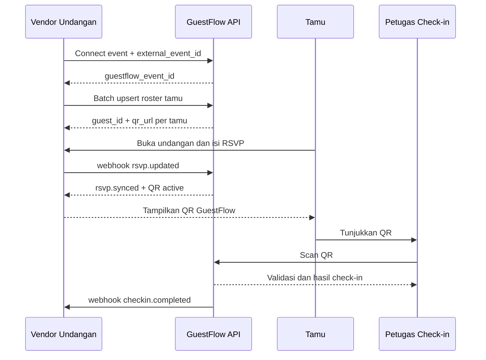

# Use Case Partnership Vendor Undangan Digital

## 1. Ringkasan

GuestFlow diintegrasikan ke platform vendor undangan digital agar QR GuestFlow
dapat ditampilkan pada halaman undangan dan halaman konfirmasi RSVP milik vendor.
Vendor tetap mengelola desain, domain, transaksi, dan pengalaman undangan.
GuestFlow menyediakan identitas tamu, QR check-in, status RSVP operasional,
validasi di lokasi, dan histori aktivitas.

Model yang direkomendasikan adalah **embedded integration** melalui API dan
webhook. QR dibuat untuk setiap tamu pada setiap acara sehingga tamu yang sama
tetap dapat memiliki QR berbeda untuk acara yang berbeda.

## 2. Tujuan Bisnis

- Vendor dapat menawarkan fitur check-in dan manajemen tamu tanpa membangun sistem baru.
- Pengguna vendor memperoleh QR check-in langsung pada undangan digital.
- GuestFlow memperoleh kanal distribusi melalui partner vendor.
- Data RSVP, QR, dan check-in dapat ditelusuri lintas sistem dengan identitas eksternal.
- Integrasi dapat digunakan oleh banyak vendor tanpa mencampur data tenant atau acara.

## 3. Aktor dan Tanggung Jawab

| Aktor | Tanggung jawab |
|---|---|
| Pemilik acara | Menghubungkan acara vendor dengan GuestFlow dan menyetujui sinkronisasi data |
| Vendor undangan digital | Menyediakan halaman undangan, RSVP, API, dan webhook |
| GuestFlow | Membuat roster tamu, invitation token, QR, validasi, check-in, dan audit |
| Tamu undangan | Membuka undangan, mengisi RSVP, dan menunjukkan QR saat hadir |
| Petugas acara | Memindai QR atau mencari tamu melalui menu check-in GuestFlow |
| Admin partnership | Mengelola partner, kredensial, scope, SLA, dan rekonsiliasi |

## 4. Kepemilikan Data

Penetapan sumber data harus jelas sejak awal agar tidak terjadi konflik pembaruan.

| Data | Sumber utama | Sinkronisasi |
|---|---|---|
| Desain dan URL undangan | Vendor | Vendor ke GuestFlow sebagai referensi |
| Event eksternal dan jadwal | Vendor atau GuestFlow sesuai kontrak | Dua arah dengan `external_event_id` |
| Profil tamu dan roster acara | GuestFlow untuk operasional | Vendor mengirim perubahan roster |
| Jawaban RSVP pada halaman vendor | Vendor | Vendor mengirim webhook ke GuestFlow |
| Status check-in | GuestFlow | GuestFlow mengirim webhook ke vendor |
| QR dan token validasi | GuestFlow | Vendor hanya menerima URL/data QR yang siap ditampilkan |
| Status delivery WhatsApp/email | GuestFlow | Opsional dikirim ke vendor sebagai status komunikasi |

Rekomendasi: **vendor menjadi sumber utama RSVP digital, GuestFlow menjadi sumber
utama check-in dan validasi QR**. GuestFlow menyimpan salinan RSVP untuk kebutuhan
operasional dan dashboard.

## 5. Use Case Utama

### UC-01 - Aktivasi Partnership

**Prasyarat:** Vendor telah disetujui sebagai partner.

1. Admin GuestFlow membuat record partner dan scope integrasi.
2. Sistem menerbitkan `client_id` dan `client_secret`, atau konfigurasi OAuth2.
3. Vendor mendaftarkan URL webhook dan URL callback.
4. Kedua pihak menguji koneksi di sandbox.
5. Integrasi diaktifkan setelah health check dan security review lulus.

**Hasil:** Vendor dapat membuat dan membaca resource GuestFlow sesuai scope.

### UC-02 - Menghubungkan Acara Vendor

1. Pemilik acara memilih menu `Aktifkan GuestFlow` di dashboard vendor.
2. Vendor meminta authorization atau mengirim `external_event_id` ke GuestFlow.
3. GuestFlow membuat atau menghubungkan tenant dan event.
4. GuestFlow mengembalikan `guestflow_event_id` dan status integrasi.
5. Event diberi status `connected` dan dapat menerima roster tamu.

**Aturan:** Satu `external_event_id` tidak boleh terhubung ke dua event GuestFlow
aktif dalam partner yang sama.

### UC-03 - Sinkronisasi Tamu

Vendor mengirim roster melalui batch API atau webhook perubahan:

```json
{
  "external_event_id": "vendor-event-123",
  "guests": [
    {
      "external_guest_id": "vendor-guest-456",
      "name": "Bambang Kusniawan",
      "phone": "+628132996537",
      "email": "guest@example.com",
      "guest_type": "friend",
      "plus_one_limit": 1
    }
  ]
}
```

GuestFlow kemudian:

1. Mencari tamu berdasarkan `partner_id + external_event_id + external_guest_id`.
2. Membuat atau memperbarui roster tamu acara.
3. Membuat invitation token opaque per tamu jika belum ada.
4. Menghasilkan QR yang mengarah ke `https://guestflow.id/i/{token}`.
5. Mengembalikan `guestflow_guest_id`, `invitation_id`, `qr_url`, dan status.

Sinkronisasi harus idempotent menggunakan `Idempotency-Key` dan tidak boleh
menggabungkan tamu hanya berdasarkan nomor WhatsApp karena nomor yang sama dapat
digunakan pada acara berbeda.

### UC-04 - Menampilkan QR pada Undangan Vendor

Vendor menampilkan QR pada salah satu kondisi berikut:

- halaman undangan setelah RSVP dikonfirmasi;
- halaman sukses RSVP;
- menu `Tiket Saya` atau `QR Check-in`;
- email/WhatsApp undangan yang dirender vendor.

Contoh respons integrasi:

```json
{
  "external_event_id": "vendor-event-123",
  "external_guest_id": "vendor-guest-456",
  "guestflow_guest_id": "guest-uuid",
  "invitation_id": "invitation-uuid",
  "qr_url": "https://guestflow.id/i/opaque-token",
  "qr_image_url": "https://guestflow.id/api/v1/partner/qr/opaque-token.svg",
  "qr_status": "active",
  "valid_for": "event"
}
```

QR tidak boleh berisi nama, nomor WhatsApp, email, atau data PII. Token harus
opaque, sulit ditebak, memiliki status aktif/revoked, dan hanya valid untuk event
yang terkait.

### UC-05 - RSVP dari Halaman Vendor

1. Tamu membuka undangan vendor.
2. Tamu mengisi RSVP pada form vendor.
3. Vendor menyimpan RSVP sebagai sumber utama.
4. Vendor mengirim event webhook ke GuestFlow:

```json
{
  "event": "rsvp.updated",
  "event_id": "vendor-event-123",
  "guest_id": "vendor-guest-456",
  "status": "attending",
  "plus_one_count": 1,
  "occurred_at": "2026-07-21T10:00:00Z",
  "idempotency_key": "rsvp-vendor-456-v3"
}
```

5. GuestFlow memperbarui salinan RSVP dan status eligibility QR.
6. GuestFlow mengembalikan acknowledgment `200` atau `202`.
7. Jika webhook gagal, vendor memasukkan event ke retry queue.

QR dapat mengikuti kebijakan partner:

- `RSVP pending`: QR belum ditampilkan atau berstatus pending.
- `attending`: QR aktif dan ditampilkan.
- `declined`: QR dinonaktifkan atau tidak ditampilkan.
- RSVP berubah setelah QR terbit: status token diperbarui tanpa membuat QR baru,
  kecuali ada kebijakan keamanan partner.

### UC-06 - Check-in di Lokasi Acara

1. Tamu menunjukkan QR dari halaman vendor.
2. Petugas memindai QR melalui GuestFlow.
3. GuestFlow memvalidasi token, tenant, event, status, dan duplikasi check-in.
4. Sistem menyimpan `checked_in_at`, petugas, perangkat, dan hasil validasi.
5. GuestFlow mengirim webhook `checkin.completed` ke vendor.
6. Vendor memperbarui status kehadiran pada halaman admin atau dashboard acara.

Hasil validasi minimum:

- `valid`: tamu dapat masuk;
- `already_checked_in`: tampilkan waktu dan petugas check-in sebelumnya;
- `revoked`: QR tidak berlaku;
- `wrong_event`: QR berasal dari acara lain;
- `not_attending`: RSVP tidak memenuhi kebijakan check-in;
- `not_found`: token tidak dikenal.

### UC-07 - Pembatalan atau Perubahan Acara

Jika acara dibatalkan, dipindah, atau tamu dihapus:

1. Vendor mengirim event `event.updated` atau `guest.removed`.
2. GuestFlow memperbarui status event atau merevoke token terkait.
3. QR lama menampilkan status tidak valid saat dipindai.
4. Vendor menerima webhook hasil perubahan.

## 6. Kontrak API yang Diusulkan

Prefix khusus partner dipisahkan dari API admin:

| Method | Endpoint | Tujuan |
|---|---|---|
| `POST` | `/api/v1/partner/events/connect` | Hubungkan acara vendor |
| `POST` | `/api/v1/partner/events/{id}/guests:batchUpsert` | Sinkronisasi roster |
| `GET` | `/api/v1/partner/events/{id}/guests/{externalGuestId}/qr` | Ambil QR tamu |
| `POST` | `/api/v1/partner/webhooks/rsvp` | Terima perubahan RSVP |
| `POST` | `/api/v1/partner/events/{id}/disconnect` | Putus integrasi acara |
| `POST` | `/api/v1/partner/webhooks/test` | Uji koneksi webhook |

Webhook dari GuestFlow:

- `invitation.created`
- `invitation.revoked`
- `rsvp.synced`
- `checkin.completed`
- `checkin.rejected`
- `event.status_changed`

Semua request menggunakan authentication scoped, timestamp, signature HMAC,
`Idempotency-Key`, correlation ID, dan response error yang konsisten.

## 7. Keamanan dan Privasi

- Gunakan OAuth2 client credentials atau API key per partner, bukan credential tenant.
- Pisahkan secret sandbox dan production.
- Batasi scope: event, guest, QR, RSVP, dan webhook secara terpisah.
- Simpan token QR dalam bentuk hash di GuestFlow; QR hanya membawa opaque token.
- Jangan menaruh token, nomor telepon, atau PII di log aplikasi maupun URL analitik.
- Terapkan rate limit, replay protection berbasis timestamp, dan rotasi secret.
- Verifikasi signature webhook sebelum memproses payload.
- Beri mekanisme penghapusan data dan retention sesuai UU PDP.
- Audit seluruh pembuatan, penerbitan, revoke, scan, dan sinkronisasi QR.

## 8. Model Partnership

### Opsi A - Referral

Vendor menawarkan GuestFlow sebagai add-on dan menerima fee referral.
Implementasi paling cepat, tetapi pengalaman aktivasi masih membutuhkan perpindahan
ke GuestFlow.

### Opsi B - Embedded API

QR, status RSVP, dan check-in ditampilkan di dashboard vendor melalui API.
Ini adalah opsi yang direkomendasikan untuk MVP partnership karena nilai integrasi
jelas tanpa perlu white-label penuh.

### Opsi C - White-label Operasional

Vendor memakai brand dan domain sendiri, tetapi engine QR/check-in GuestFlow berjalan
di belakang layar. Potensi revenue lebih besar, namun membutuhkan SLA, support,
monitoring, billing, dan pengaturan tenant yang lebih kompleks.

## 9. Alur To-Be



## 10. MVP Partnership

### Termasuk

- satu partner vendor pilot;
- connect event secara manual atau melalui API;
- batch upsert tamu;
- QR per tamu dan `qr_url` siap tampil;
- webhook `rsvp.updated` dari vendor;
- endpoint validasi/check-in GuestFlow;
- webhook `checkin.completed` ke vendor;
- idempotency, signature, audit log, dan retry webhook;
- dashboard status integrasi dan dead-letter queue sederhana.

### Tidak termasuk MVP

- white-label penuh;
- settlement dan revenue sharing otomatis;
- multi-vendor marketplace;
- QR offline tanpa koneksi;
- sinkronisasi dua arah untuk seluruh field profil tamu;
- custom workflow berbeda untuk setiap vendor.

## 11. Acceptance Criteria Pilot

- Vendor dapat menghubungkan satu event sandbox tanpa membuat tenant ganda.
- Minimal 1.000 tamu dapat disinkronkan ulang secara idempotent.
- QR tamu tampil pada halaman RSVP vendor.
- QR tamu acara A ditolak pada check-in acara B.
- RSVP `attending` mengaktifkan QR sesuai SLA yang disepakati.
- RSVP `declined` atau tamu dihapus menonaktifkan QR.
- Check-in sukses dan duplikat dapat dilihat di kedua sistem.
- Webhook gagal dapat di-retry tanpa membuat data ganda.
- Tidak ada PII atau secret yang masuk ke log dan payload QR.
- Seluruh request partner memiliki correlation ID dan audit trail.

## 12. Roadmap Implementasi

1. **Discovery dan legal:** data processing agreement, SLA, revenue model, dan pemilik data.
2. **Contract design:** API schema, event mapping, webhook signature, error code, dan idempotency.
3. **Sandbox:** partner credential, test event, test roster, dan simulator webhook.
4. **Pilot:** satu vendor, satu event produksi terbatas, monitoring dan rekonsiliasi manual.
5. **Scale:** self-service onboarding, dashboard integrasi, billing, support, dan multi-vendor.

## 13. Risiko Utama dan Mitigasi

| Risiko | Mitigasi |
|---|---|
| Event atau tamu ganda | Composite external identity dan idempotency key |
| Webhook terlambat | Queue, retry exponential, dan reconciliation API |
| QR disebarkan ke orang lain | QR per tamu, audit scan, optional device/session binding |
| Vendor mengubah RSVP tanpa webhook | Scheduled reconciliation dan pull API |
| Integrasi vendor down saat check-in | Cache roster terbatas dan mode manual dengan audit |
| PII bocor melalui integrasi | Scope minimum, masking log, encryption, retention policy |
| Partner berhenti bekerja sama | Disconnect flow dan revoke credential/token |
